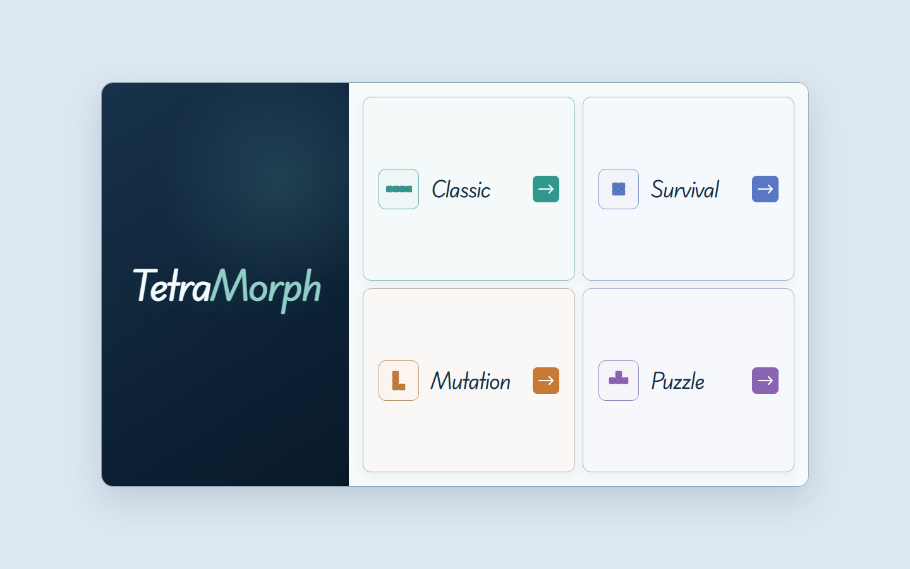
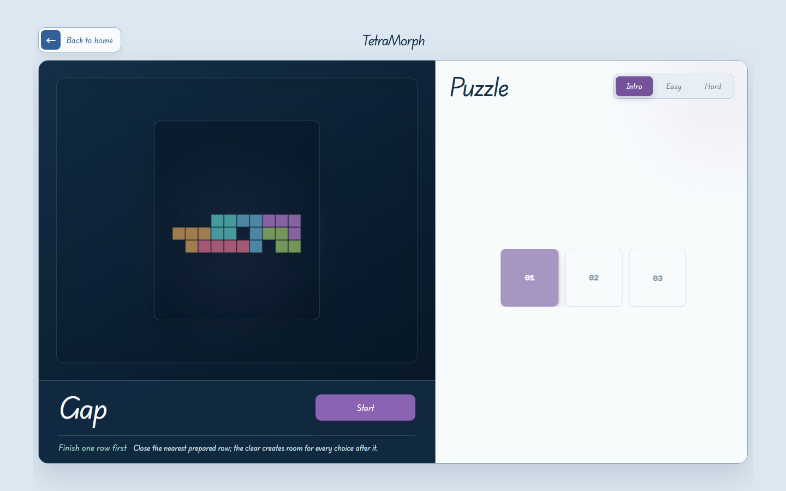
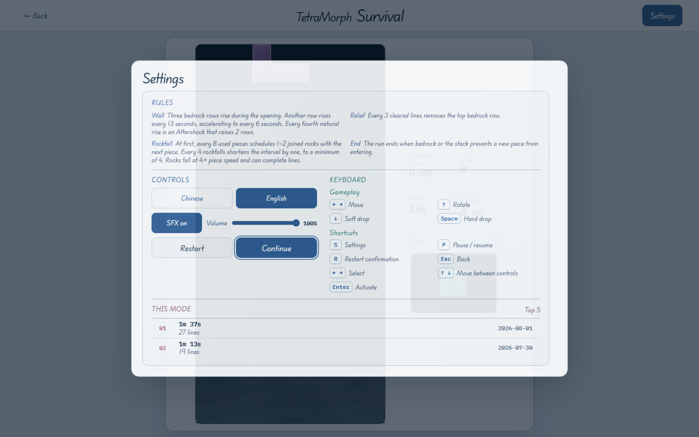

# TetraMorph

A modern mutation-driven falling-block puzzle game built for precise play,
readable pressure, and deterministic replay.

## Features

- **Classic Mode** — clear lines, build combos, and manage steadily rising gravity.
- **Survival Mode** — play above rising bedrock while clearable falling stones reshape
  the board.
- **Mutation Mode** — trigger visible item carriers and adapt to five temporary or
  immediate rule mutations.
- **Puzzle Campaign** — solve 50 authored boards with fixed queues, undo support, and
  a staged learning curve.

## Technical Highlights

- **PixiJS renderer** with one gameplay canvas and renderer-owned pieces, materials,
  particles, and effects.
- **Deterministic Core** isolated from React, PixiJS, browser timing, storage, and audio.
- **Replay system** with seeded runs and public state snapshots for reproducible QA.
- **Procedural audio** generated locally without licensed music or runtime media calls.
- **TypeScript architecture** with explicit Core, runtime, input, renderer, platform,
  persistence, and React composition boundaries.

## Controls

| Action | Keyboard |
| --- | --- |
| Move | `←` / `→` or `A` / `D` |
| Rotate clockwise | `↑`, `W`, or `X` |
| Rotate counter-clockwise | `Q` |
| Soft drop | `↓` |
| Hard drop | `Space` |
| Pause / resume | `P` |
| Settings | `S` |
| Restart confirmation | `R` |
| Puzzle undo | `Z` |
| Back / close | `Esc` |
| Select / activate | Arrow keys / `Enter` |

Touch controls are available on compact portrait and landscape layouts. The interface
also supports Chinese and English, reduced-motion preferences, and adjustable SFX.

## Development

Requirements: a current Node.js release compatible with Vite 8 and npm.

```bash
npm ci
npm run dev
```

Release gates:

```bash
npm run typecheck
npm run test
npm run build
```

The deterministic game rules live in `src/game/core`; React owns page composition and
lifecycle, while PixiJS owns the single board canvas. Project contracts and release
evidence are maintained under `docs/`.

## Screenshots

### Mode selection



### Puzzle campaign



### Settings


