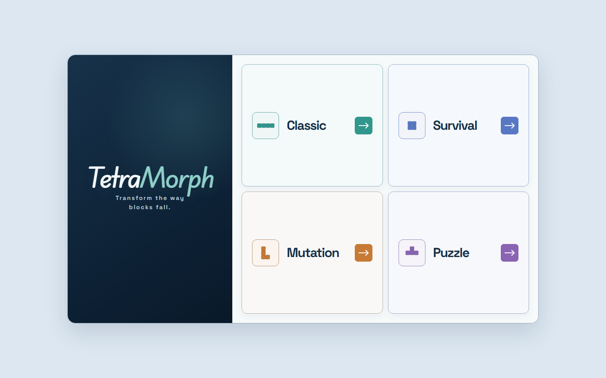
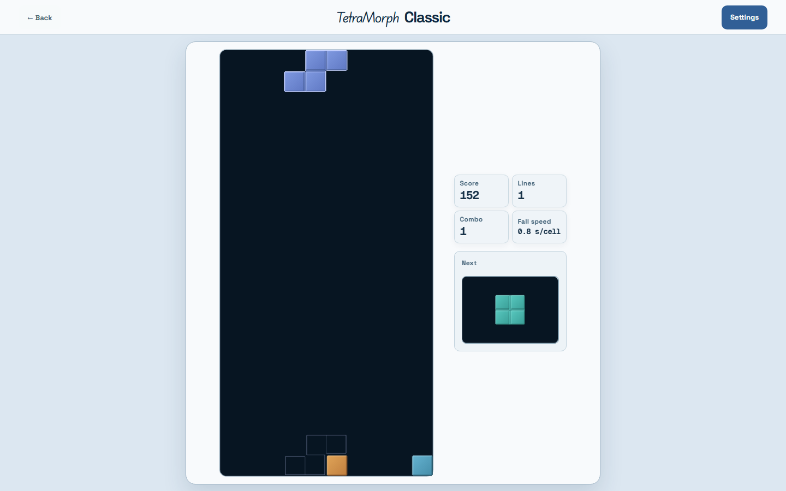
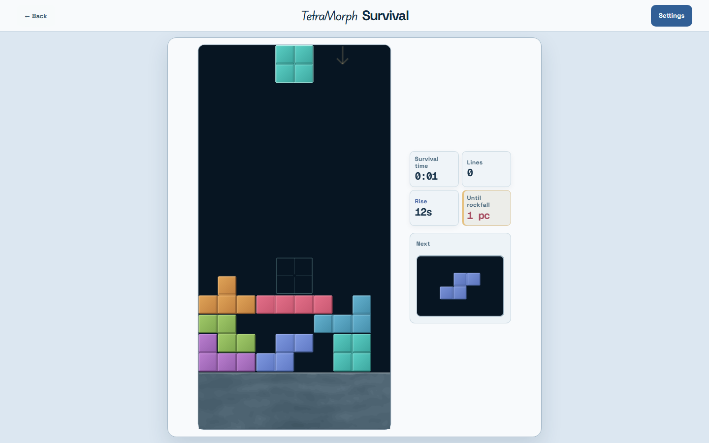
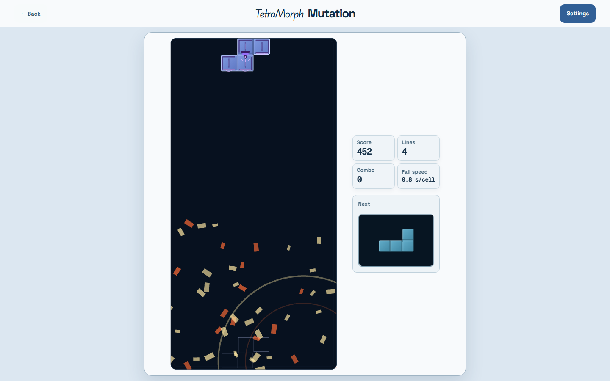
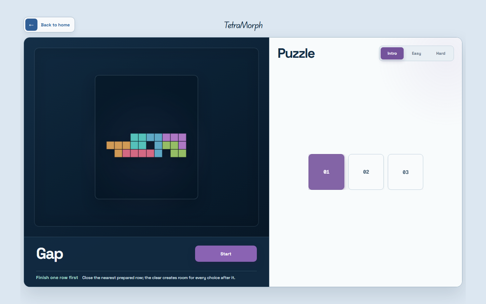
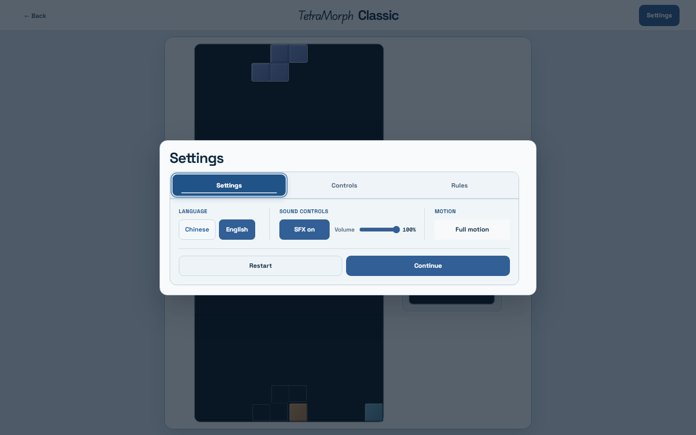

# TetraMorph showcase package

TetraMorph is a deterministic, mutation-driven falling-block game about reading
pressure, adapting to rule changes, and solving authored board states. Four modes share
one precise Core while presenting distinct play: escalating Classic, environmental
Survival, ability-driven Mutation, and a 50-level Puzzle curriculum.

## Final frames

### Home

### Classic

### Survival

### Mutation

### Puzzle campaign

### Settings

## 48-second capture sequence

Record the final candidate at 1440 x 900 and 60 fps. Use only the game's procedural
SFX; do not add licensed music or fabricate board state.

| Time | Shot | Required beat |
| --- | --- | --- |
| 0–4 s | Home | Fade from the centered wordmark to the four mode cards. |
| 4–12 s | Classic | Move, rotate, hard-drop, and finish on a real line clear with score/combo response. |
| 12–20 s | Survival | Show rising bedrock, then hold on the source-column rockfall warning and incoming pressure. |
| 20–32 s | Mutation | Reveal a marked carrier, trigger Bomb, and let the impact particles resolve into the live board. |
| 32–39 s | Puzzle | Move from the authored silhouette to the Intro/Easy/Hard curriculum and lesson copy. |
| 39–44 s | Settings | Show the three-tab rail, reduced motion, bilingual UI, controls, and Rules/records surfaces. |
| 44–48 s | Home | Return to the four-mode matrix and end on the wordmark plus positioning line. |

Keep cuts on lock, clear, warning, and impact beats. Do not cover the board or Next well
with captions; if captions are needed, keep them in the outer page margin and use no
more than one short line per shot.

## Publication copy

### GitHub repository description

> Deterministic TypeScript/PixiJS falling-block game with four modes, mutation abilities, a 50-level puzzle campaign, and bilingual play.

### Resume bullets

- Built a deterministic TypeScript/PixiJS falling-block game with four distinct modes,
  seeded replay, a 50-level authored Puzzle curriculum, and keyboard, touch, Chinese,
  English, and reduced-motion support.
- Designed a single-Canvas runtime with renderer-independent Core logic and idempotent
  teardown; validated 318 tests and reduced production font payload by 57.6% without
  changing the accepted visual system.

### Portfolio description

> TetraMorph explores how one falling-block foundation can support four genuinely
> different kinds of decision-making. Classic emphasizes clean stacking and tempo;
> Survival adds rising bedrock and telegraphed rockfall; Mutation turns marked pieces
> into temporary rule changes; Puzzle teaches board-reading techniques through 50
> authored fixed-sequence challenges. I separated the deterministic simulation from
> React, PixiJS, browser timing, audio, and persistence, then built a bilingual,
> keyboard/touch-safe presentation around one gameplay Canvas. The release-candidate
> pass focused on first-run clarity, visible system feedback, responsive layouts,
> reduced motion, reproducible evidence, and lifecycle cleanup rather than adding more
> features.
